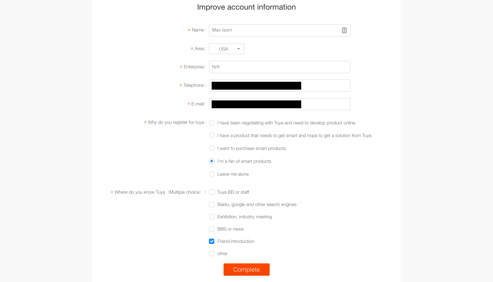
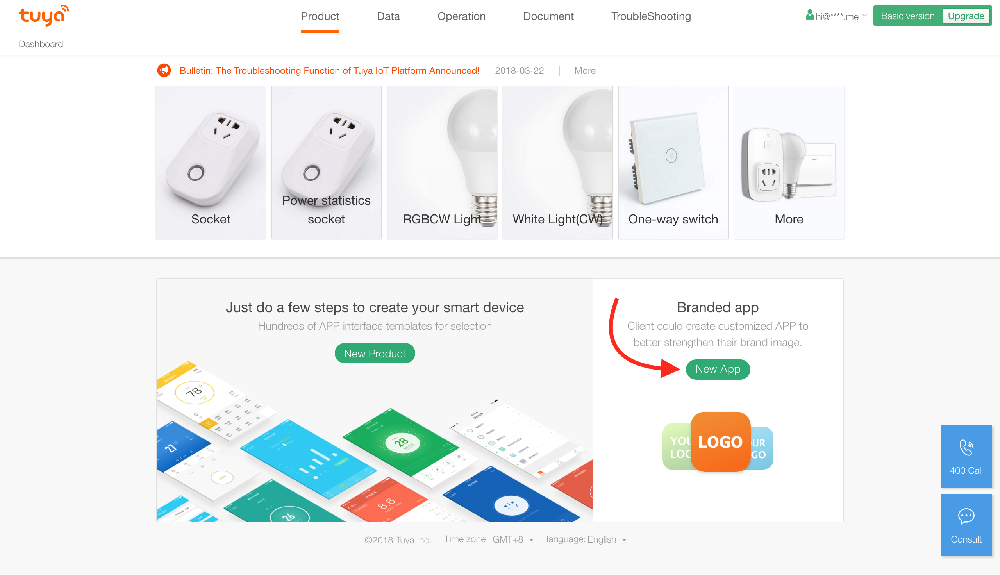
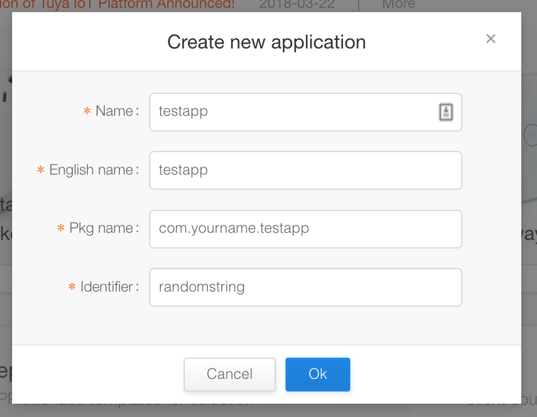
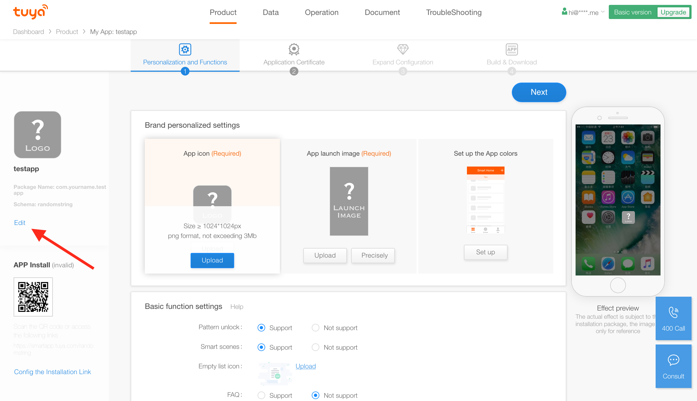
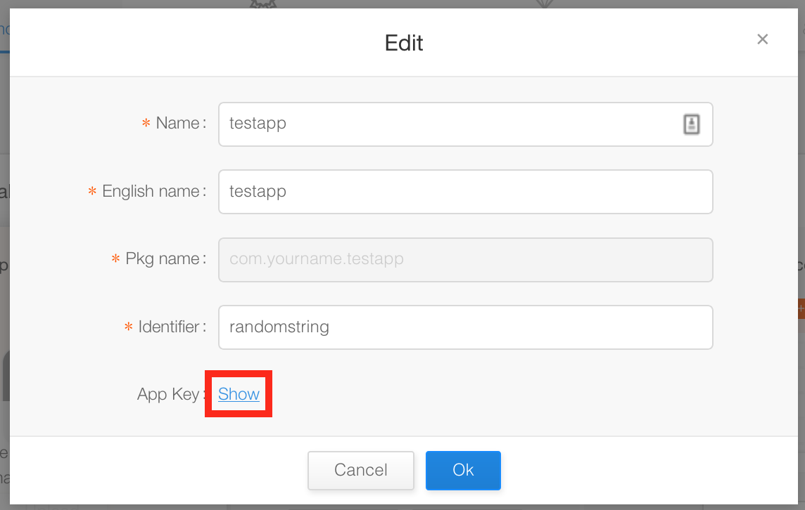
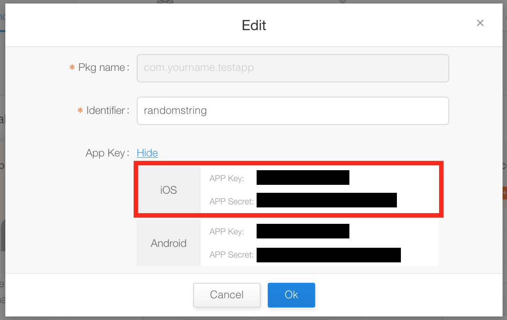

## Acquiring API Keys

It's a fairly simple process to acquire Tuya API keys, and should take less than 5 minutes.

1. [Signup](https://iot.tuya.com/signup) for a new account.  When asked to fill out additional details, see below screenshot for example values.

2. Once logged in, click **New App** from your dashboard.

3. Next, fill out the app details.  You will not have to use this information in the future, so don't worry too much about the values.  `Pkg name` and `Identifier` must be unique.

4. Once your app has been created, you will be taken to the app's dashboard.  Click **Edit** on the left hand side.

5. Click **Show**.

6. Your API keys are then shown.  Use the **iOS keys**, not the Android keys.
